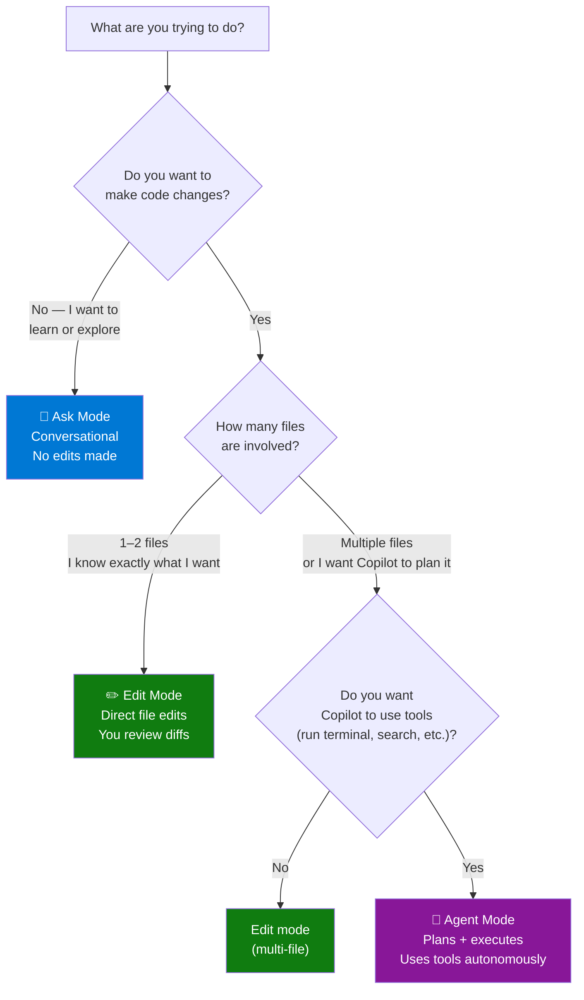
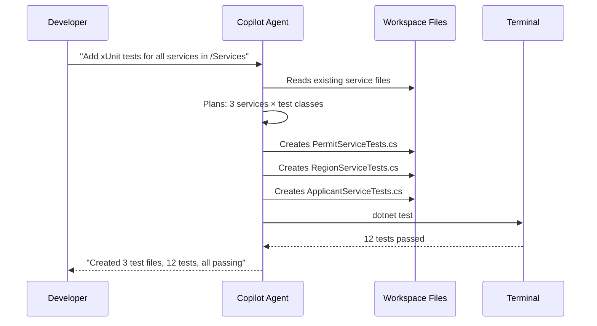

# Ask / Edit / Agent Mode

GitHub Copilot in VS Code offers three interaction modes. Choosing the right mode dramatically affects how useful Copilot is for a given task.

---

## Mode Comparison



---

## Detailed Comparison

| Feature | Ask | Edit | Agent |
|---------|-----|------|-------|
| **Makes code changes** | ❌ | ✅ | ✅ |
| **Runs terminal commands** | ❌ | ❌ | ✅ |
| **Searches files** | ❌ | Limited | ✅ |
| **Multi-file edits** | ❌ | ✅ | ✅ |
| **Uses MCP tools** | ❌ | ❌ | ✅ |
| **Requires review/approval** | N/A | Each diff | Checkpoint prompts |
| **Best for** | Q&A, explain, plan | Targeted refactors | Complex multi-step tasks |
| **Instruction files applied** | ✅ | ✅ | ✅ |

---

## Ask Mode

The default conversational mode. Use it to:
- Ask questions about code, architecture, or APIs
- Understand what existing code does
- Get explanations of error messages
- Plan a refactoring approach before doing it
- Understand which Copilot customizations apply

**Example prompts:**
```
What does this PermitService class do?
What's the difference between IEnumerable and IReadOnlyList?
How should I structure a .NET 8 minimal API?
What coding conventions apply to this project?
```

---

## Edit Mode

Direct file editing mode. Copilot proposes changes as diffs that you accept or reject. Use it to:
- Add a method to an existing class
- Refactor a specific function
- Update a file to match new conventions
- Fix a known bug

**Example prompts:**
```
Add XML doc comments to all public methods in this file.
Refactor this method to use async/await.
Extract this logic into a separate class.
```

To open Edit mode: Chat panel → switch from "Ask" to "Edit" in the dropdown selector.

---

## Agent Mode

The most powerful mode. Copilot plans the task, then autonomously:
- Reads files across the workspace
- Makes changes to multiple files
- Runs terminal commands
- Calls MCP tools (when configured)
- Iterates until the task is done

Use it for:
- "Add logging to all controllers in this project"
- "Create a full CRUD API for the Permits entity with tests"
- "Migrate this controller from .NET Framework to .NET 8"
- Anything that would take you 10+ minutes of manual changes

**Agent mode respects all instruction files** — your `.github/copilot-instructions.md` is active throughout.



---

## Switching Between Modes

In the Copilot Chat panel, use the **mode selector dropdown** (bottom of the chat input area) to switch between Ask, Edit, and Agent.

> **Tip:** Start in Ask mode to plan, switch to Agent mode to execute.
