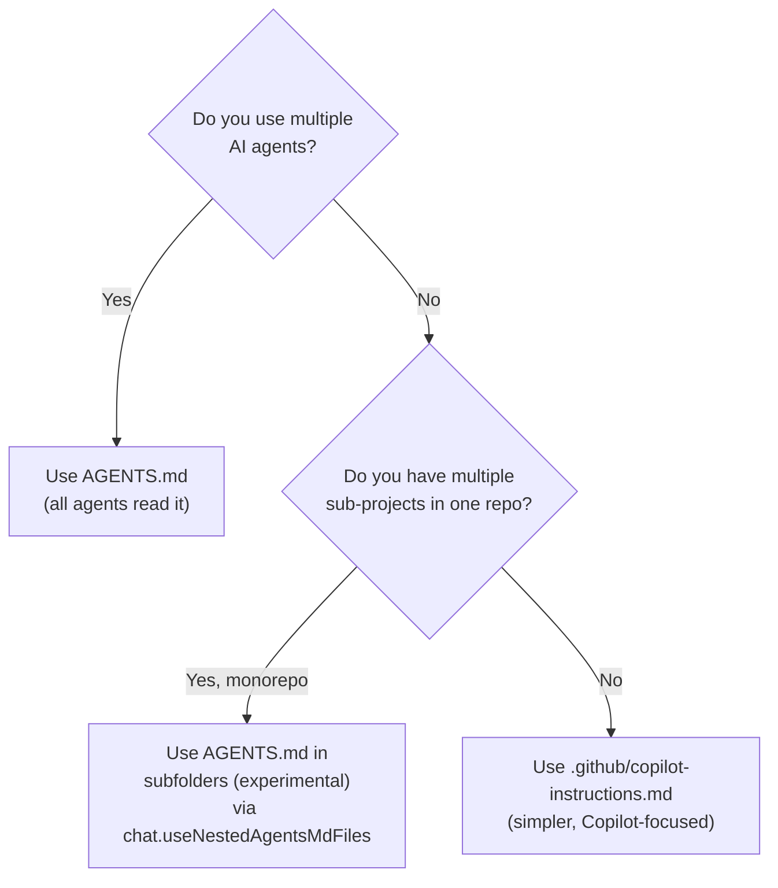

# Always-On Instruction Files

Always-on instructions are **automatically included in every chat request** without you lifting a finger. They are ideal for project-wide conventions, architecture decisions, and standards that every AI response in the workspace should respect.

---

## `copilot-instructions.md`

**Path:** `.github/copilot-instructions.md`  
**Scope:** All chat requests within this workspace  
**Recognized by:** GitHub Copilot in VS Code, Visual Studio, JetBrains, etc.

VS Code automatically detects this file at workspace load time and injects its contents into every Copilot Chat request context.

### What to put in it

| Good for | Not good for |
|----------|-------------|
| Coding style and naming conventions | Secrets or tokens |
| Technology stack declarations | User-specific preferences |
| Architecture patterns to follow or avoid | Very long documents (stay under ~3,000 words) |
| Security requirements | Frequently-changing content |
| Documentation standards | Content that overrides user preference |

### Structure (from this repo)

```markdown
# Copilot Instructions — My Project

## Language & Runtime
- Primary language: C# 12 / .NET 8
- Target framework: net8.0

## Naming Conventions
- Classes: PascalCase
- Private fields: _camelCase

## Error Handling
- Use ArgumentNullException.ThrowIfNull() for guard clauses
...
```

### Where to save it

```
your-repo/
└── .github/
    └── copilot-instructions.md    ← must be exactly here
```

> The file must be at the **repo root** inside `.github/`. Nested locations are not detected.

### Verify it's loading

In VS Code, open Copilot Chat → right-click in the chat panel → **Diagnostics**. You'll see a list of all loaded instruction files and any errors.

---

## `AGENTS.md`

**Path:** `AGENTS.md` (repo root) or in subfolders (experimental)  
**Scope:** All chat requests in the workspace (same as copilot-instructions.md)  
**Recognized by:** GitHub Copilot, Claude Code, and other AI agent tools

`AGENTS.md` is the multi-agent equivalent of `copilot-instructions.md`. If your team uses Claude Code alongside VS Code Copilot, a single `AGENTS.md` gives all agents the same instructions.

### When to use AGENTS.md over copilot-instructions.md



> ✅ You can use **both** `AGENTS.md` and `copilot-instructions.md` at the same time — Copilot reads both.

Enable/disable AGENTS.md support: `chat.useAgentsMdFile` setting.

---

## `CLAUDE.md` / `.claude/CLAUDE.md`

**Path:** Multiple locations (VS Code checks them all)

| Location | Scope |
|----------|-------|
| `CLAUDE.md` (repo root) | This workspace |
| `.claude/CLAUDE.md` | This workspace |
| `~/.claude/CLAUDE.md` | All workspaces (personal) |
| `CLAUDE.local.md` | This workspace, not committed to git |

Use this if your team works with **Claude Code** and wants a single instruction file recognized by both Claude Code and VS Code Copilot.

Enable/disable: `chat.useClaudeMdFile` setting.

---

## Generating Instructions Automatically

VS Code can analyse your project and generate a starter `copilot-instructions.md` for you:

1. Open Copilot Chat
2. Type `/init` — Copilot scans your workspace and generates instructions tailored to your codebase
3. Review and edit the generated file

Or use the Command Palette (`Ctrl+Shift+P`) → **Chat: Generate Chat Instructions**.

---

## Live Example

This repo's always-on instruction file: [.github/copilot-instructions.md](../../.github/copilot-instructions.md)

Try opening it now and ask Copilot Chat: *"What does each section of this instructions file do?"*
