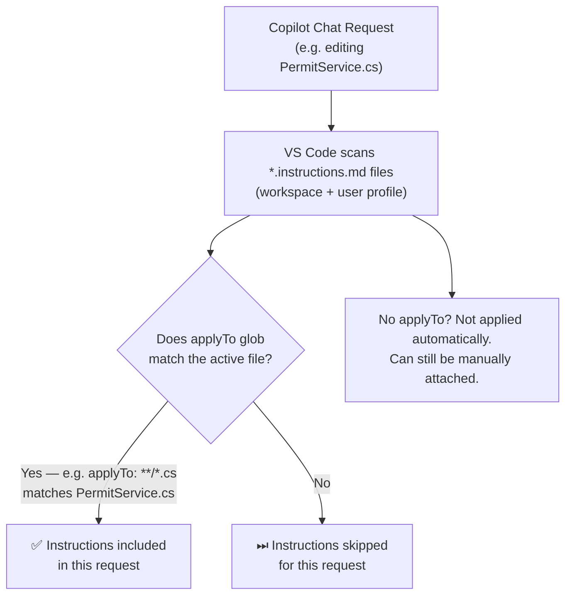
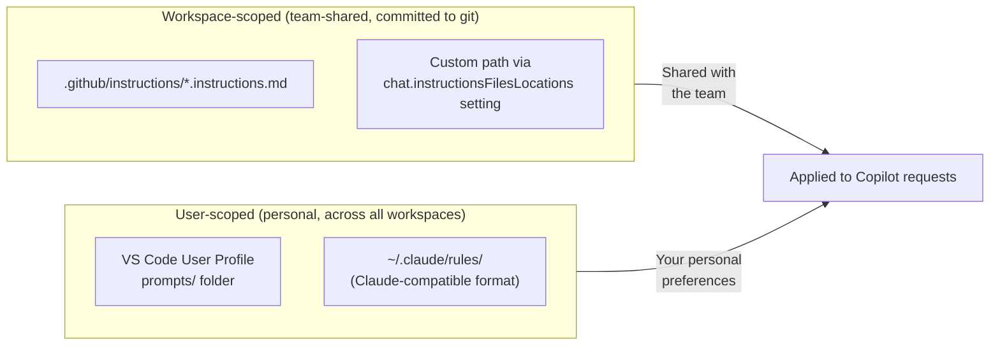

# File-Based Instruction Files (`*.instructions.md`)

File-based instructions are applied **conditionally** — only when the files the agent is working on match a glob pattern you specify, or when the description matches the current task.

This lets you have different conventions for frontend vs. backend code, C# vs. SQL files, or tests vs. production code — without polluting every request with irrelevant context.

---

## How They Work



---

## File Format

```markdown
---
name: "Python Standards"         # shown in VS Code UI
description: "PEP 8 conventions" # shown on hover
applyTo: "**/*.py"                # glob — which files trigger this
---

# Python Coding Standards
- Follow PEP 8 style guide.
- Use type hints for all function signatures.
- Write docstrings for public functions.
```

### YAML Frontmatter Fields

| Field | Required | Description |
|-------|----------|-------------|
| `name` | No | Display name in the VS Code Chat Instructions list |
| `description` | No | Short description shown on hover |
| `applyTo` | No | Glob pattern for automatic application. Use `**` for all files. If omitted, not applied automatically. |

---

## Where to Save Them



**To create a workspace instruction file:**  
VS Code Chat → Configure Chat (⚙) → **Chat Instructions** → **New instruction file** → choose **Workspace**

**To create a personal instruction file:**  
VS Code Chat → Configure Chat (⚙) → **Chat Instructions** → **New instruction file** → choose **User profile**

Or use the Command Palette: `Ctrl+Shift+P` → **Chat: New Instructions File**

---

## Real Examples from This Repo

### C# Standards (`applyTo: **/*.cs`)

```markdown
---
name: "C# / ASP.NET Core Standards"
applyTo: "**/*.cs"
---

## Naming
- Classes: PascalCase
- Private fields: _camelCase
- Async methods: suffix with Async

## Error Handling
- ArgumentNullException.ThrowIfNull() for guard clauses
```

→ Full file: [.github/instructions/csharp-standards.instructions.md](../../.github/instructions/csharp-standards.instructions.md)

### Test Standards (`applyTo: **/*Tests.cs`)

```markdown
---
name: "Test Standards"
applyTo: "**/*Tests.cs"
---

## Framework
- xUnit + Moq
- Naming: MethodName_StateUnderTest_ExpectedBehavior
```

→ Full file: [.github/instructions/test-standards.instructions.md](../../.github/instructions/test-standards.instructions.md)

---

## Tips

- **Keep them focused** — one concern per file (e.g. one for C#, one for tests, one for SQL)
- **Reference other files** using Markdown links: `[see schema](../../07-databases/samples/schema.sql)`
- **Reference agent tools** using `#tool:<tool-name>` syntax: e.g. `#tool:githubRepo` to trigger a tool when the instruction is active
- **Check what loaded**: right-click in Chat → **Diagnostics** to see all active instruction files

---

## Troubleshooting

| Problem | Check |
|---------|-------|
| Instructions not applying | Is the `applyTo` glob correct? Use VS Code's File Glob docs to verify. |
| File not showing in picker | Is it in `.github/instructions/` or in your user profile `prompts/` folder? |
| Pattern-based instructions | Enable `chat.includeApplyingInstructions` setting |
| Instructions via links | Enable `chat.includeReferencedInstructions` setting |

Use Chat Diagnostics: right-click in Chat panel → **Diagnostics**.
