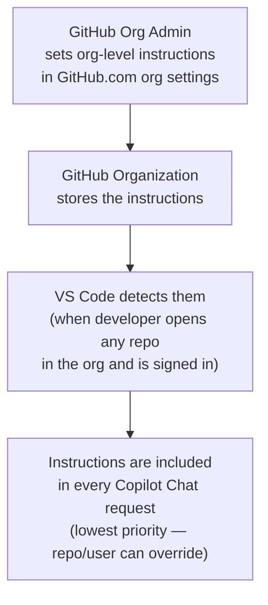

# Organization-Level Instructions

Organization-level instructions allow GitHub admins to define Copilot instructions that apply across **all repositories and workspaces** within a GitHub organization — without requiring every developer to configure anything locally.

This is the ideal mechanism for government-wide or department-wide standards that should apply to every developer, every repo, every time.

---

## How It Works



---

## Use Cases for Customer <Name>

| Use Case | What to put in org instructions |
|----------|--------------------------------|
| Security policy | "Never log PII data. Always use parameterised queries. Never hard-code credentials." |
| Approved tech stack | "Use ASP.NET Core for web APIs. Use Entity Framework Core for data access. No third-party ORMs." |
| French/English support | "All user-facing strings must support both English and French. Use resource files for localization." |
| Accessibility standards | "Web UIs must comply with WCAG 2.1 Level AA. All form inputs need ARIA labels." |
| Licensing | "All generated code must be compatible with the MIT license. Do not include GPL-licensed code." |

---

## Setting Up Org-Level Instructions

1. Go to your GitHub organization settings at `https://github.com/organizations/{org}/settings`
2. Navigate to **Copilot** → **Custom Instructions**
3. Add your instructions in Markdown format
4. Save — instructions are immediately distributed to all org members

> **Note:** This requires GitHub Copilot Business or Enterprise plan for the organization.

---

## Enabling Discovery in VS Code

By default, VS Code discovers org-level instructions automatically. If not visible, enable:

```json
// .vscode/settings.json or user settings
{
  "github.copilot.chat.organizationInstructions.enabled": true
}
```

---

## Priority

Org-level instructions are **lowest priority** — they form the baseline that repo-level and personal instructions can build on or override:

```
Personal (user profile) → override
Repo (.github/copilot-instructions.md) → override
Organization → baseline
```

This means individual teams can still customize Copilot's behaviour for their specific repo without losing the org-wide standards.

---

## Verifying What's Loaded

In VS Code, use the Command Palette: `Ctrl+Shift+P` → **Chat: Configure Instructions** — org-level instructions appear in the list with a label indicating their source.

---

## Further Reading

- [Add custom instructions for your organization — GitHub Docs](https://docs.github.com/en/copilot/how-tos/configure-custom-instructions/add-organization-instructions)
- [Copilot Business / Enterprise plans](https://github.com/features/copilot/plans)
