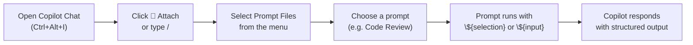

# Prompt Files (`*.prompt.md`)

Prompt files are **reusable, on-demand prompts** that you can trigger from the VS Code Copilot Chat prompt picker. Unlike instruction files that apply automatically, prompt files are run intentionally — you pick one, optionally provide inputs, and Copilot executes it.

Think of them as **saved, parameterised workflows** for tasks you do repeatedly: code review, test generation, legacy explanation, SQL writing.

---

## How to Use a Prompt File



Alternatively: type `/` in the chat input → Copilot shows available prompt files in a quick-pick list.

---

## File Format

```markdown
---
name: "Code Review"                              # shown in VS Code UI
description: "Structured review of C# code"     # tooltip on hover
---

# Review this code

Please review the selected code:

\`\`\`csharp
${selection}         ← inserts whatever text is currently selected in the editor
\`\`\`

Check for: naming conventions, null handling, async usage.
```

### Available Variables

| Variable | What it inserts |
|----------|----------------|
| `${selection}` | Currently selected text in the active editor |
| `${file}` | Full contents of the active file |
| `${input:label}` | Prompts the user for text input with the given label |
| `${workspaceFolder}` | Absolute path to the workspace root |

---

## Where to Save Them

| Location | Scope | How to create |
|----------|-------|--------------|
| `.github/prompts/*.prompt.md` | This workspace (team-shared) | Create file manually |
| `VS Code User Profile: prompts/` | All your workspaces (personal) | Chat → Configure Chat → New Prompt File → User profile |

---

## Prompt Files in This Repo

All five prompt files live in `.github/prompts/` and are **active right now** in this workspace:

| Prompt | Trigger | What it does |
|--------|---------|-------------|
| [code-review.prompt.md](../../.github/prompts/code-review.prompt.md) | Select code → pick prompt | Structured C# code review (5 criteria) |
| [generate-tests.prompt.md](../../.github/prompts/generate-tests.prompt.md) | Select class → pick prompt | xUnit + Moq tests with full coverage |
| [explain-legacy.prompt.md](../../.github/prompts/explain-legacy.prompt.md) | Select legacy code → pick prompt | Explanation + modern .NET equivalents |
| [sql-query.prompt.md](../../.github/prompts/sql-query.prompt.md) | Pick prompt → type request | T-SQL query for OntarioPermits schema |
| [modernize-dotnet.prompt.md](../../.github/prompts/modernize-dotnet.prompt.md) | Select code → pick prompt | Incremental .NET Framework → .NET 8 migration |

---

## Creating Your Own Prompt File

1. Create a `.md` file with a `.prompt.md` extension in `.github/prompts/`
2. Add optional YAML frontmatter with `name` and `description`
3. Write your prompt in Markdown
4. Use `${selection}` to reference highlighted code, or `${input:label}` for user input
5. The file appears immediately in the VS Code prompt picker — no restart needed

### Example: Architecture Review Prompt

```markdown
---
name: "Architecture Review"
description: "Reviews a C# class for SOLID principles"
---

# Architecture Review

Review the following class for SOLID principles:

\`\`\`csharp
${selection}
\`\`\`

For each principle (SRP, OCP, LSP, ISP, DIP):
- ✅ Met / ⚠️ Partial / ❌ Violated
- Brief explanation
- Refactoring suggestion if violated
```

---

## Tips for Effective Prompt Files

- **Be specific** — the more structured your prompt, the more consistent Copilot's output
- **Define the output format** — tell Copilot exactly how to structure the response (numbered list, table, diff, etc.)
- **Chain prompts** — reference other prompt files or instruction files in the body
- **Use `${input:}`** to make prompts interactive — ask the user for context before running
- **Version control them** — they live in `.github/prompts/`, they're in git, they're reviewable
