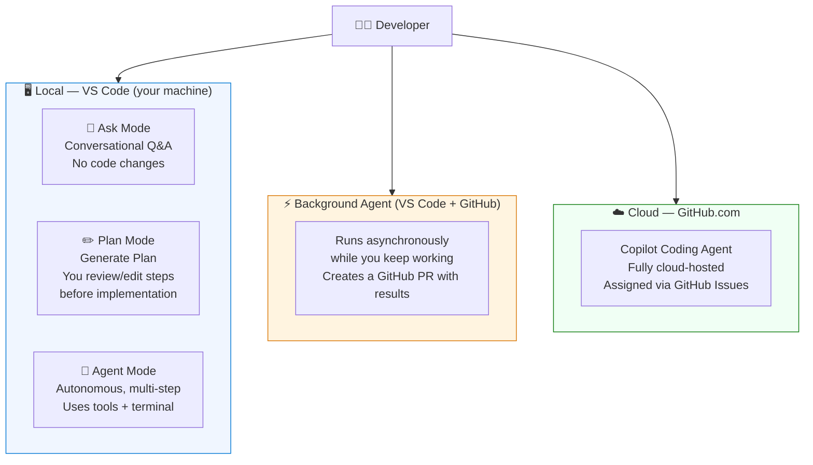
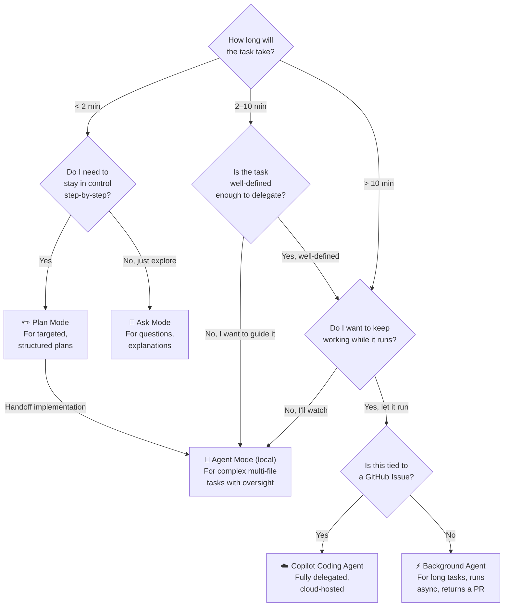
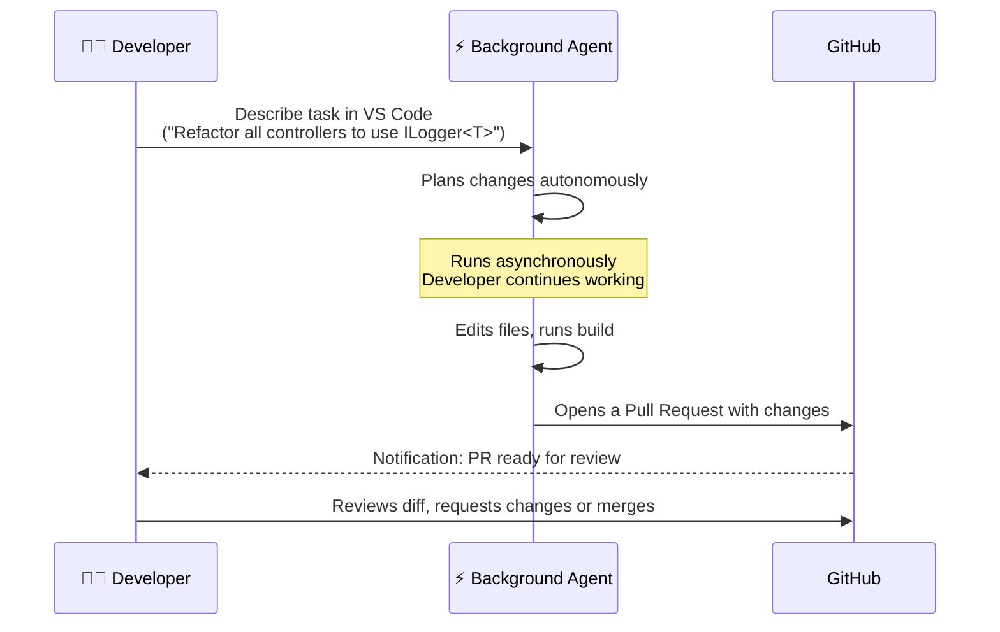
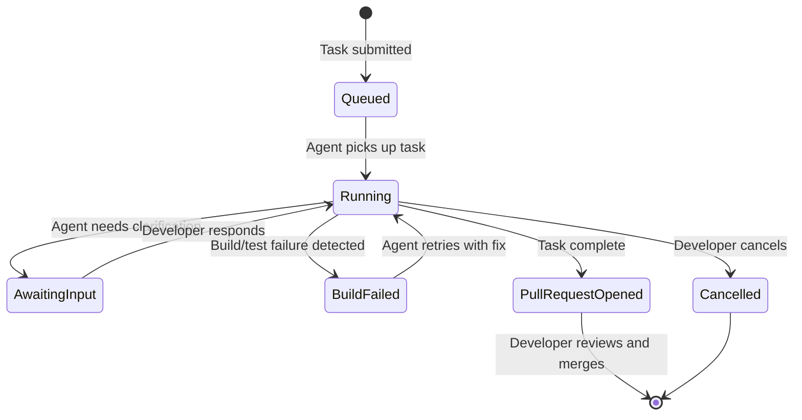

# Module 02 — VS Code Agents

> **What you'll learn:** The different execution environments for GitHub Copilot agents in VS Code — from the conversational modes in the IDE, to Background Agent running asynchronous long-horizon tasks, to Cloud-based execution on GitHub.com. Includes a decision guide to help you pick the right agent for any task.

---

## Agent Architecture Overview

---

## Which Agent Should I Use?

---

## Contents

| Doc | What it covers |
|-----|---------------|
| [docs/background-agent.md](docs/background-agent.md) | What Background Agent is, how to use it, GitHub Actions integration |
| [docs/cloud-agents.md](docs/cloud-agents.md) | Copilot Cloud Agent (GitHub.com), cloud sandbox execution |
| [docs/sub-agents.md](docs/sub-agents.md) | Delegation patterns, chaining, practical .NET scenario |
| [docs/agent-selection-guide.md](docs/agent-selection-guide.md) | Detailed selection guide with worked examples |

> **Agent modes (Ask / Plan / Agent)** are covered in [Module 01 → docs/agent-modes.md](../01-customization/docs/agent-modes.md).
> **Copilot Coding Agent on GitHub.com** is covered in [Module 09](../09-copilot-on-github/README.md).

---

## Background Agent Lifecycle

---

## Background Agent States

