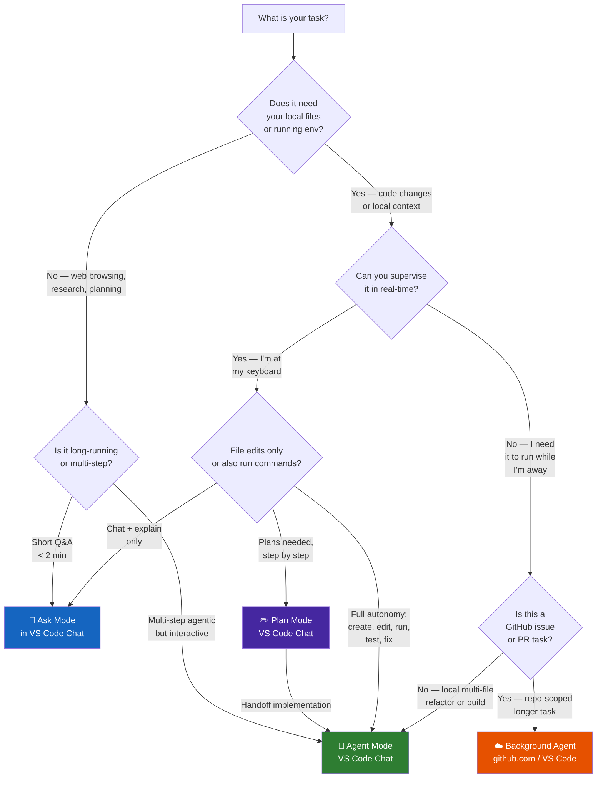

# Agent Selection Guide

> **Decision framework:** Choose the right Copilot agent surface for your task. Wrong tool choice wastes time; right tool choice multiplies it.

---

## Quick-Reference Decision Tree



---

## Feature Comparison Matrix

| Capability | Ask Mode | Plan Mode | Edit Mode (deprecated) | Agent Mode | Background Agent |
|---|:---:|:---:|:---:|:---:|:---:|
| Answer questions | ✅ | ✅ | ✅ | ✅ | ✅ |
| Explain code | ✅ | ✅ | ✅ | ✅ | ✅ |
| Edit a single file | ❌ | ❌ | ✅ | ✅ | ✅ |
| Edit multiple files | ❌ | ❌ | ✅ | ✅ | ✅ |
| Run terminal commands | ❌ | ❌ | ❌ | ✅ | ✅ |
| Run tests and iterate | ❌ | ❌ | ❌ | ✅ | ✅ |
| Works while you're away | ❌ | ❌ | ❌ | ❌ | ✅ |
| Opens a PR automatically | ❌ | ❌ | ❌ | ❌ | ✅ |
| Uses MCP tools | ❌ | ⚠️* | ❌ | ✅ | ✅ |
| Reads context from `#file` | ✅ | ✅ | ✅ | ✅ | ✅ |
| Runs in cloud / CI | ❌ | ❌ | ❌ | ❌ | ✅ |

*Plan Mode can use additional tools, including MCP tools, when explicitly configured for planning workflows.

---

## Worked Examples — Customer <Name> Context

### Example 1 — "What does this method do?"

**Task:** Understand a 200-line legacy WCF service method.

**Best choice:** Ask Mode

```text
#file:LegacyPermitService.cs
Explain what the ProcessPermitApplication method does. Summarise in plain English
suitable for a non-developer business analyst.
```

*Why Ask Mode:* Read-only, focused, conversational. No edits needed.

---

### Example 2 — "Generate a test plan for the permit submission flow"

**Task:** Given a C# interface, produce a comprehensive test plan and generate the xUnit tests.

**Best choice:** Plan Mode first, then hand off to Agent Mode

```text
/generate-tests
#file:Services/IPermitSubmissionService.cs

After reviewing the plan, hand off implementation to Agent Mode to generate the tests,
run them, and iterate on any failures.
```

*Why Plan Mode first:* Test generation benefits from separating planning from implementation. Plan Mode helps clarify scope, identify scenarios and edge cases, and produce a structured test strategy before any code is written.

*How to hand off to Agent Mode:* Once the plan looks right, continue in the same chat or use the Plan-to-Agent handoff to ask Agent Mode to implement the approved test plan, generate the xUnit tests, run them, and fix any failures.

---

### Example 3 — "Migrate this controller to ASP.NET Core"

**Task:** Modernise `PermitController.cs` from Web API 2 to .NET 8 minimal API.

**Best choice:** Agent Mode

```text
Modernise PermitController.cs from Web API 2 to ASP.NET Core .NET 8.
Steps:
1. Replace [RoutePrefix] with [Route] attribute (ASP.NET Core style)
2. Replace HttpResponseMessage with IActionResult / ActionResult<T>
3. Replace ConfigurationManager with constructor-injected IConfiguration
4. Replace Console.WriteLine with constructor-injected ILogger<PermitController>
5. Run dotnet build and fix any compilation errors
6. Run dotnet test and fix any failing unit tests
```

*Why Agent Mode:* Requires multi-file edits (controller + tests), terminal (`dotnet build`, `dotnet test`), and iterative error fixing.

---

### Example 4 — "Add audit logging to all endpoints"

**Task:** Add an `AuditMiddleware` class, register it in `Program.cs`, write tests — while you attend a meeting.

**Best choice:** Background Agent

```text
Add audit logging middleware to the CustomerPermits API:
1. Create Middleware/AuditMiddleware.cs that logs (timestamp, method, path, status,
   duration, user identity) to ILogger<AuditMiddleware>
2. Register it in Program.cs after UseAuthentication
3. Write xUnit tests in Tests/AuditMiddlewareTests.cs covering: request logged,
   exception path logged, health-check path excluded
4. Run dotnet test — fix any failures
5. Open a PR titled "feat: add audit request logging middleware"
```

*Why Background Agent:* Multi-step, fully autonomous, results in a reviewable PR you can examine on return.

---

### Example 5 — "Fix a null reference bug"

**Task:** A specific NullReferenceException on line 47 of `PermitRepository.cs`.

**Best choice:** Agent Mode

```text
The call to permit.Region.Name on line 47 throws NullReferenceException when
Region is null. Apply a null-conditional fix that returns "Unknown" as the default.
```

*Why Agent Mode:* Single targeted change, you want to review the diff before accepting.

---

## Common Mistakes

| Mistake | Consequence | Correct approach |
|---|---|---|
| Using Ask Mode for multi-file edits | Copilot produces code blocks you have to copy-paste manually | Use Edit or Agent Mode |
| Using Background Agent for a 2-minute task | Overkill — background agent spins up a VM, queues work | Use Agent Mode interactively |
| Using Plan Mode and expecting terminal commands | Plan Mode cannot run `dotnet build` — errors stay unresolved | Escalate to Agent Mode |
| Not providing `#file` context in Ask Mode | Copilot answers generically, not about your specific code | Always attach relevant files |
| Assigning an ambiguous task to Background Agent | Agent misinterprets scope; unwanted changes land in PR | Write precise, testable acceptance criteria |

---

## Customer <Name> Scenario Map

| Scenario | Recommended | Rationale |
|---|---|---|
| Explain a WCF contract to a business analyst | Ask Mode | Read-only, plain-language explanation |
| Fix a single SQL injection vulnerability | Edit Mode | Targeted surgical fix |
| Modernise a full Web API 2 controller | Agent Mode | Multi-file, needs build + test iteration |
| Add WCAG 2.1 AA attributes to 30 Razor views | Background Agent | Repetitive, multi-file, no supervision needed |
| Generate test plan from a service interface | Agent Mode | Tool use + iterative feedback valuable |
| Scaffold a new `RegionController` CRUD | Agent Mode | Create + test + build loop |
| Create nightly audit report from query results | Background Agent | Long-running, schedulable, produces PR |

---

## Related Documentation

- [Background Agent deep-dive](background-agent.md)
- [Cloud Agents on GitHub.com](cloud-agents.md)
- [Sub-agent delegation pattern](sub-agents.md)
- [Module 01 — Agent Modes overview](../../01-customization/docs/agent-modes.md)
