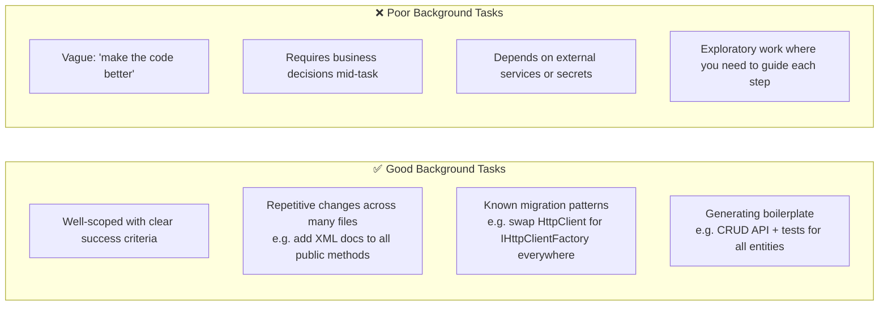
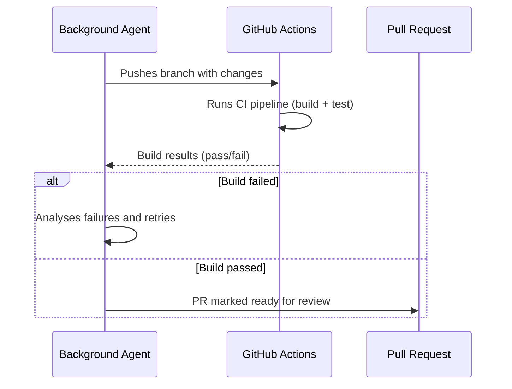

# Background Agent

Background Agent lets you assign a long-horizon task to Copilot and walk away. It runs **asynchronously in the background** — you keep working — and when finished, it opens a pull request with the results.

---

## What It Is

Background agents in VS Code, powered by **GitHub Copilot CLI**,Delete. They are ideal for complex, multi-step tasks like:

- Refactoring large codebases
- Writing tests across multiple files
- Implementing features end-to-end

Key capabilities:

- **Isolated changes** — often utilise Git worktrees to keep agent changes separate from your active work
- **Unified management** — start, monitor, and manage Copilot CLI sessions from the **Chat** view in VS Code
- **Local execution** — agents run autonomously on your local machine while you continue other work in the editor
- **Parallelism** — run multiple Copilot CLI sessions simultaneously to tackle independent tasks at the same time

---

### Isolation Modes

Copilot CLI supports two isolation modes that control how agent changes are applied to your codebase. You choose the mode when creating a new Copilot CLI session.

| Mode | Behaviour |
|------|-----------|
| **Worktree** | VS Code creates a Git worktree in a separate folder. All agent changes are applied there, keeping them isolated from your main workspace until you review and apply them. |
| **Workspace** | The agent operates directly in your current workspace. Changes are applied in place, with no separate worktree. |

> **Worktree isolation** — Use this to prevent the agent from interfering with your active work. Changes remain separate until you're ready to review and merge them.
>
> **Workspace isolation** — Use this when you want agent changes applied directly to your current workspace as the agent works.

---

Background Agent is a **cloud-assisted, long-running agent** that:
- Accepts a natural-language task description
- Plans and executes changes across your codebase autonomously
- Runs on an isolated branch
- Creates a PR when done (or asks for clarification if stuck)

It's designed for tasks that would take 10–30+ minutes manually: large refactors, adding logging or observability across a whole project, migrating from one library to another, generating full test suites, etc.

---

## How to Trigger It

### Method 1: From VS Code Chat

1. Open Copilot Chat (`Ctrl+Alt+I`)
2. Switch to **Agent mode** using the mode selector
3. Select **Copilot CLI** (from the dropdown of delegate session)
4. Describe your task clearly
5. Pick Isolation Mode (Worktree or Workspace)
6. Copilot confirms the task, spins off the background work, and you're free to continue
7. Monitor progress in the **Sessions** view — you can see what it's doing, and it will get notification to view the changes and **Apply** these.

### Method 2: From a GitHub Issue

In Agent mode, reference a GitHub issue:
```
Work on #123 — the issue describes adding pagination to all list endpoints
```

Copilot will read the issue description and use it as the task specification.

---

## What Makes a Good Background Task



---

## Reviewing the Results

When Background Agent completes:
1. A **GitHub Pull Request** is opened on a new branch
2. You receive a VS Code notification (and a GitHub notification)
3. Review the diff in the PR — accept, request changes, or close
4. Copilot can iterate: add a comment to the PR with follow-up instructions and it will continue

---

## Limitations

| Limitation | Detail |
|-----------|--------|
| Requires GitHub repo | Must be connected to a GitHub repository |
| No access to running services | Can't hit live APIs, databases, or external dependencies during execution |
| Time limits | Very long tasks may time out — break them into smaller chunks |
| Non-deterministic | Same task may produce slightly different results each run |
| Requires review | Always review the PR — Background Agent can make mistakes |

---

## GitHub Actions Integration

Background Agent can be configured to run your CI pipeline after making changes:



This means Background Agent won't create a PR with broken builds — it will try to fix failures first.

---

## Tips

- Write your task description like a detailed ticket — the more context, the better the result
- Include success criteria: *"All public methods in /Services/ should have XML doc comments. Build must pass."*
- For large migrations, start with a small scope and validate before expanding
- Check the Background Agent's progress in the **Copilot** panel — you can see what it's working on
