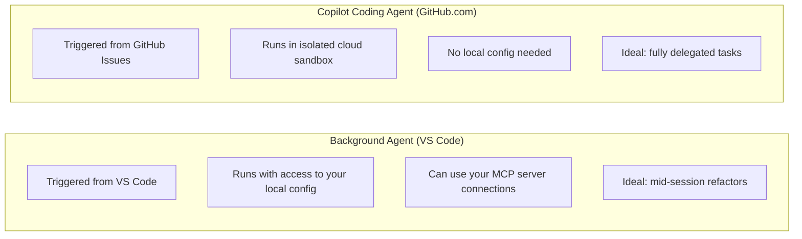
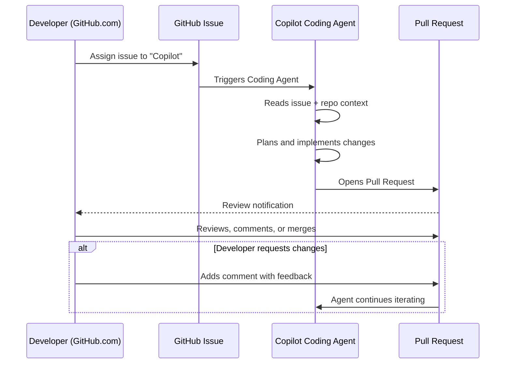

# Cloud Agent (Copilot on GitHub.com)

The **Copilot Coding Agent** is a fully cloud-hosted agent that runs entirely within the GitHub.com environment — no local VS Code session required.

> **Deep coverage** of the Coding Agent (including Codex integration, Code Review, and Copilot Spaces) is in [Module 09 — Copilot on GitHub.com](../../09-copilot-on-github/README.md).  
> This page covers the core concept from a VS Code agent perspective.

---

## What Makes It Different from Background Agent

| | Background Agent | Coding Agent |
|-|-----------------|-------------|
| **Where it runs** | VS Code + cloud | GitHub.com cloud |
| **How to trigger** | VS Code chat | Assign GitHub Issue to Copilot |
| **Local repo access** | Yes | No (clones it) |
| **MCP tools** | Your configured servers | GitHub-provided tools |
| **Result** | PR opened | PR opened |
| **Model** | Configurable | GPT-5.1-Codex / Claude agents |

---

## When to Use the Cloud Agent

- You want to delegate a task without opening VS Code
- The task is tied to a GitHub Issue and fits a clear acceptance criteria
- You're managing work from GitHub mobile or the web UI
- You want multiple agents working on different issues simultaneously

---

## Interaction Model

---

## See Also

- [Module 09 — Copilot on GitHub.com](../../09-copilot-on-github/README.md) — full coverage of the Coding Agent, Code Review integration, and Copilot Spaces
