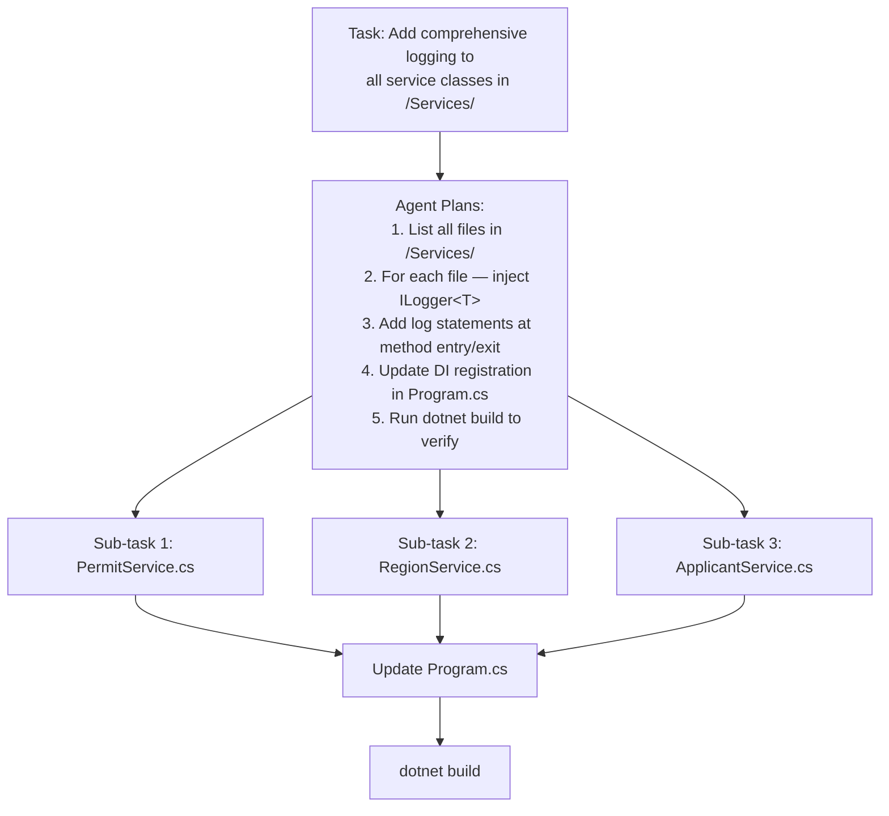
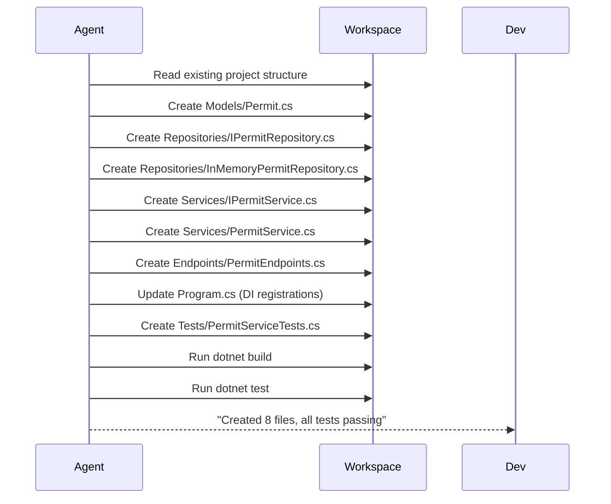

# Sub-agents and Agent Delegation

In complex tasks, Copilot Agent mode can break a problem down and effectively "delegate" sub-tasks — spawning focused work streams for different parts of the codebase. Understanding this pattern helps you structure your prompts to get the best results.

---

## The Delegation Pattern

When you give Agent mode a complex task, it internally:

1. **Plans** — breaks the goal into steps
2. **Sequences** — determines which steps depend on each other
3. **Executes** — works through each step, using tools as needed
4. **Validates** — runs tests or build checks to confirm success



---

## Practical .NET Example

### Task given to Agent mode:

```
Create a complete CRUD API for the Permit entity:
- ASP.NET Core minimal API endpoints (GET all, GET by ID, POST, PUT, DELETE)
- PermitService with interface IPermitService
- In-memory repository (IPermitRepository → InMemoryPermitRepository)
- xUnit tests for PermitService covering all methods
- Register all services in Program.cs
- Target .NET 8
```

### What Agent mode does:



---

## Tips for Effective Delegation

### Be specific about the contract

```
❌ Vague: "Add tests for the service layer"

✅ Clear: "Create xUnit tests for PermitService.cs covering:
   - GetPermitAsync: happy path, not found (null), null ID exception
   - CreatePermitAsync: happy path, duplicate ID exception
   - UpdatePermitAsync: happy path, not found exception
   Use Moq for IPermitRepository. Follow the naming pattern MethodName_State_Expected."
```

### Provide context references

```
Create integration tests for the PermitController.
The controller is in Controllers/PermitController.cs.
Use the existing WebApplicationFactory pattern from the test project.
The service layer uses IPermitService — mock it.
```

### Set acceptance criteria

```
After the migration, ensure:
- dotnet build passes with 0 warnings
- All existing tests still pass
- No hard-coded connection strings remain
```

---

## Chaining Agent Sessions

For very large tasks, split them across multiple Agent mode sessions:

1. **Session 1:** "Create the data layer (models, interfaces, repositories)"
2. **Session 2:** "Create the service layer using the repositories from Session 1"
3. **Session 3:** "Create the API endpoints and wire up DI"
4. **Session 4:** "Create comprehensive tests for all layers"

This keeps each session focused and reviewable before proceeding.
