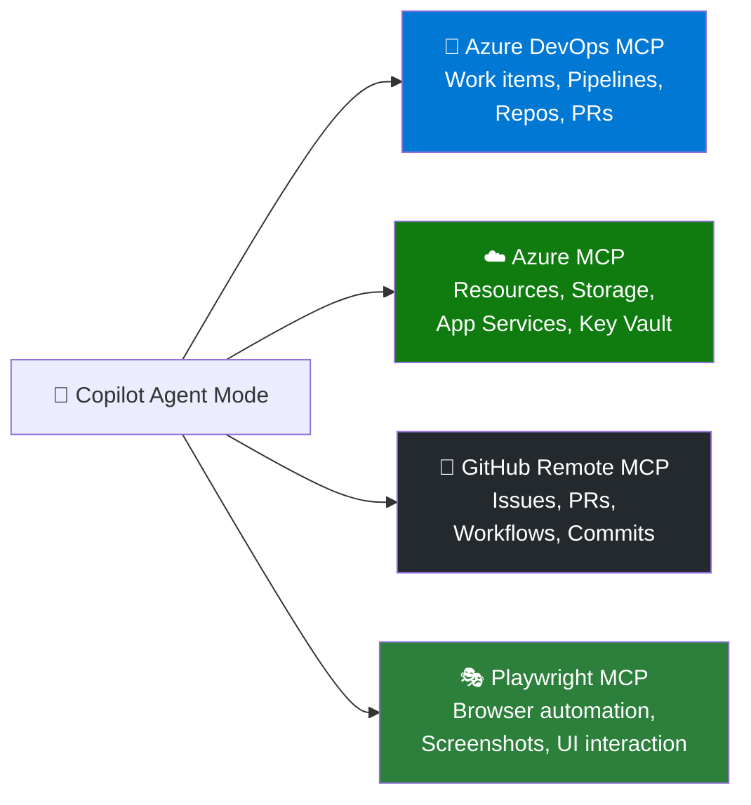

# Module 03 — MCP Servers

[](.)
[](.)

> **What you'll learn:** What the Model Context Protocol (MCP) is, how to connect VS Code to real MCP servers, and how to use those connections to give Copilot Agent mode superpowers — like querying Azure, managing GitHub, running Playwright UI actions, and accessing Azure DevOps.

---

## What is MCP?

**Model Context Protocol (MCP)** is an open standard that allows AI assistants like Copilot to connect to external data sources and tools. When you configure an MCP server in VS Code, Copilot Agent mode can:

- Query real-time data from that system
- Take actions (create resources, run queries, interact with UIs)
- Use the server as a tool — invoked automatically when relevant to a task

MCP servers run locally or remotely and expose a set of **tools** that the agent can call.

---

## Configuring MCP in VS Code

MCP servers are configured in an `mcp.json` file. VS Code looks for it in:

| Location | Scope |
|----------|-------|
| `.vscode/mcp.json` | This workspace only |
| `~/.config/Code/User/mcp.json` | All workspaces (user-level) |

Basic format:

```jsonc
{
  "servers": {
    "my-server-name": {
      "command": "npx",
      "args": ["-y", "@modelcontextprotocol/server-github"],
      "env": {
        "GITHUB_PERSONAL_ACCESS_TOKEN": "${env:GITHUB_TOKEN}"
      }
    }
  }
}
```

After saving `mcp.json`, restart VS Code (or use **MCP: Restart Server** from the Command Palette) and the server appears as available tools in Agent mode.

---

## Available MCP Servers in This Module



| Server | Auth Method | Key Use Cases |
|--------|-------------|--------------|
| [Azure DevOps MCP](azure-devops-mcp/README.md) | Personal Access Token (PAT) | Query work items, manage pipelines, review PRs |
| [Azure MCP](azure-mcp/README.md) | Azure CLI (`az login`) | List/inspect Azure resources, storage, App Services |
| [GitHub Remote MCP](github-remote-mcp/README.md) | GitHub CLI (`gh auth login`) | Issues, PRs, workflows, commit history |
| [Playwright MCP](playwright-mcp/README.md) | None (Node.js) | Browser automation, screenshots, UI interaction |

---

## Quick Start: All Servers

Copy the combined `.vscode/mcp.json` from this module to your workspace:

```jsonc
// .vscode/mcp.json — combined config for all 4 servers
// Prerequisites: az login, gh auth login, PAT for Azure DevOps
{
  "servers": {
    "azure-devops": {
      "command": "npx",
      "args": ["-y", "@microsoft/azure-devops-mcp"],
      "env": {
        "AZURE_DEVOPS_ORG_URL": "${env:AZURE_DEVOPS_ORG_URL}",
        "AZURE_DEVOPS_PAT": "${env:AZURE_DEVOPS_PAT}"
      }
    },
    "azure": {
      "command": "npx",
      "args": ["-y", "@azure/mcp@latest", "server", "start"]
    },
    "github": {
      "command": "npx",
      "args": ["-y", "@github/mcp-server-github"],
      "env": {
        "GITHUB_PERSONAL_ACCESS_TOKEN": "${env:GITHUB_TOKEN}"
      }
    },
    "playwright": {
      "command": "npx",
      "args": ["@playwright/mcp@latest"]
    }
  }
}
```

---

## Per-Server Guides

- [Azure DevOps MCP](azure-devops-mcp/README.md) — setup + 5 example prompts
- [Azure MCP](azure-mcp/README.md) — setup + 5 example prompts
- [GitHub Remote MCP](github-remote-mcp/README.md) — setup + 5 example prompts
- [Playwright MCP](playwright-mcp/README.md) — setup + 5 example prompts
