# Module 04 — Copilot CLI

[](.)
[](.) [](.)

> **What you'll learn:** GitHub Copilot CLI is a standalone AI agent that runs directly in your terminal. Unlike the old `gh copilot suggest/explain` extension, this is a full conversational agent — it can write and edit code, run git operations, interact with GitHub.com, create PRs, manage issues, and more. This module covers interactive and programmatic modes, plan mode, `/fleet` for parallel task execution, and customization options.

> **Official docs:** [About GitHub Copilot CLI](https://docs.github.com/en/copilot/concepts/agents/copilot-cli/about-copilot-cli) · [/fleet command](https://docs.github.com/en/copilot/concepts/agents/copilot-cli/fleet)

---

## What is GitHub Copilot CLI?

GitHub Copilot CLI is a **standalone AI agent** you run from your terminal. It can:

- Make changes to code in your current project
- Run shell commands, git operations, and build tools on your behalf
- Interact with GitHub.com — create PRs, manage issues, review code, create workflows
- Work interactively (conversational session) or programmatically (script-friendly)
- Manage its own context window and compress history automatically

It is **not** the old `gh copilot suggest/explain` GitHub CLI extension. It's a completely separate product installed as the `copilot` command.

---

## How Copilot CLI Works — Modes

```mermaid
flowchart TB
    subgraph INTERACTIVE["💬 Interactive Mode  —  copilot"]
        direction LR
        ASK["Default: Ask / Execute Mode\nConversational — describe what you want,\nCopilot plans and acts step by step"]
        PLAN["Plan Mode  (Shift+Tab)\nCopilot builds a structured plan first,\nclarifies scope, then writes code"]
    end

    subgraph PROGRAMMATIC["⚙️ Programmatic Mode  —  copilot -p \"...\""]
        direction LR
        PROG["Single prompt → completes → exits\nUse --allow-tool flags for automation\nPipe scripts: ./my-script.sh | copilot"]
    end

    DEV["👩‍💻 Developer"] --> INTERACTIVE
    DEV --> PROGRAMMATIC

    style INTERACTIVE fill:#0d1117,stroke:#2da44e
    style PROGRAMMATIC fill:#0d1117,stroke:#bc8cff
```



---

## Interactive Mode

Start an interactive session by running:

```bash
copilot
```

Within the session you can have a natural conversation. Copilot plans and acts step by step, asking for permission before running potentially destructive commands.

**Switching to Plan Mode:** Press `Shift+Tab` to cycle to plan mode. Here Copilot will ask clarifying questions, build a structured implementation plan, and wait for your approval before writing any code. This is useful for large or ambiguous tasks where you want to stay in control.

**Steering the conversation:**
- Send follow-up messages while Copilot is thinking to steer the direction
- When Copilot requests permission to use a tool, reject it and give inline feedback
- Use `/compact` to manually compress context if the session grows large

---

## Programmatic Mode

Pass a single prompt on the command line — Copilot completes the task and exits:

```bash
copilot -p "Show me this week's commits and summarize them" --allow-tool 'shell(git)'
```

Pipe from a script:

```bash
./generate-task.sh | copilot
```

**Tool permission flags:**

| Flag | Behaviour |
|------|-----------|
| `--allow-tool 'shell(git)'` | Allow only `git` commands without prompting |
| `--allow-tool 'write'` | Allow file edits without prompting |
| `--allow-all-tools` | Allow everything — use carefully in automation |
| `--deny-tool 'shell(rm)'` | Prevent `rm` from running even if all-tools is on |

---

## Use Cases

### Local tasks

```bash
copilot
# Then type conversationally:

Change the background-color of H1 headings to dark blue

Show me the last 5 changes made to CHANGELOG.md — who changed it, when, and what

Suggest improvements to content.js

Commit the changes to this repo

Create a Next.js dashboard app that tracks GitHub Actions build metrics — then give me instructions to run it
```

### GitHub.com tasks

```bash
# In a Copilot CLI session:

List my open PRs

List all open issues assigned to me in my-org/my-repo

I've been assigned this issue: https://github.com/my-org/my-repo/issues/42 — start working on it in a suitably named branch

In the root of this repo, add a security.md file and create a pull request to add it

Create a PR that updates the README at https://github.com/my-org/my-repo — change "How to run" to "Example usage"

Find good first issues for a new team member in my-org/my-repo

List any Actions workflows in this repo that add comments to PRs
```

---

## /fleet — Parallel Task Execution

The `/fleet` slash command (used within a Copilot CLI session) breaks a complex task into smaller **independent subtasks** that run in parallel via subagents.

```mermaid
flowchart LR
    MAIN["Main Copilot Agent\nOrchestrator"]
    subgraph PARALLEL["Runs in parallel"]
        S1["Subagent 1\nTask A"]
        S2["Subagent 2\nTask B"]
        S3["Subagent 3\nTask C"]
    end
    RESULT["Results merged\nby orchestrator"]

    MAIN --> PARALLEL
    PARALLEL --> RESULT

    style PARALLEL fill:#0d1117,stroke:#f0883e
```



**How to use it:**

1. Press `Shift+Tab` to enter plan mode
2. Describe your complex request — Copilot builds a structured plan
3. When the plan is done, select **"Accept plan and build on autopilot + /fleet"**
4. Or type `/fleet` in any message to explicitly request parallel execution

**Best for:**
- Creating a suite of tests for multiple classes simultaneously
- Refactoring several unrelated files in a large codebase
- Running analysis or documentation tasks across modules
- Multi-step tasks with independent, parallelizable parts

> **Note:** Each subagent uses its own context window and consumes separate premium requests. See [docs/fleet.md](docs/fleet.md) for full details.

---

## Customization

| Feature | Description |
|---------|-------------|
| **Custom instructions** | Add a project-level instructions file to tell Copilot about your stack, build commands, and conventions — all instruction files combine automatically |
| **MCP servers** | Connect Copilot CLI to external tools via MCP (e.g. the Azure DevOps MCP or GitHub MCP) |
| **Custom agents** | Create specialized versions of Copilot for specific tasks (e.g. a `test-writer` agent) — reference them with `@agent-name` |
| **Hooks** | Execute shell commands at key points during agent execution (validation, logging, security scanning) |
| **Copilot Memory** | Copilot builds a persistent understanding of your repo's conventions across sessions |

---

## Context Management

```bash
/compact       # Manually compress conversation history
/context       # See token usage breakdown
/model         # Switch model — default is Claude Sonnet 4.5 (1×)
/mcp           # List connected MCP servers
/feedback      # Submit feedback
```

Auto-compaction kicks in when the session reaches **95% of the token limit**, compressing history in the background without interrupting your workflow.

---

## Security

- Copilot CLI only runs from **trusted directories** — you confirm trust on startup
- Tool permissions are requested individually at runtime (yes / yes for session / no + feedback)
- For sensitive environments, run Copilot CLI inside a **container/VM** with restricted permissions
- Never use `--allow-all-tools` in directories containing sensitive data you don't want modified

---

## Model

The default model is **Claude Sonnet 4.5 (1×)**. Change it with `/model` or `--model`:

```bash
copilot --model claude-opus-4-5
```

Premium request multipliers apply per interaction (same budget as VS Code Copilot Chat).

---

## Contents

| File | What it covers |
|------|---------------|
| [docs/cli-features.md](docs/cli-features.md) | Installation, interactive mode, programmatic mode, tool permissions, context management |
| [docs/fleet.md](docs/fleet.md) | `/fleet` slash command — parallel subagents, autopilot mode, when to use |
| [examples/cli-demos.sh](examples/cli-demos.sh) | Annotated example sessions for local tasks and GitHub.com tasks |

---

## Installation

See the [official install guide](https://docs.github.com/en/copilot/how-tos/set-up/install-copilot-cli).

```bash
# macOS (example via install script)
# Follow instructions at: https://docs.github.com/en/copilot/how-tos/set-up/install-copilot-cli

# Verify installation
copilot --version

# Start an interactive session
copilot
```

**Requirements:**
- Linux, macOS, or Windows (PowerShell or WSL)
- A GitHub account with any Copilot plan (Pro / Business / Enterprise)
- GitHub CLI authenticated: `gh auth login`
