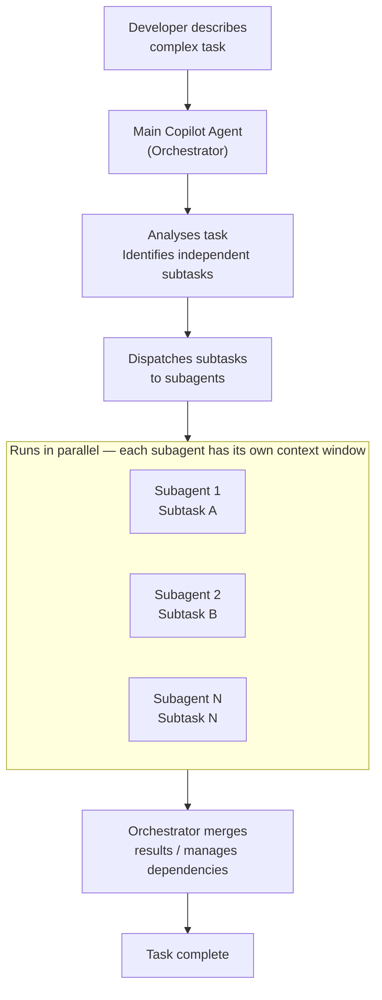

# Copilot CLI — /fleet Command

> **Source:** [Running tasks in parallel with /fleet](https://docs.github.com/en/copilot/concepts/agents/copilot-cli/fleet)

The `/fleet` slash command in Copilot CLI breaks a complex implementation plan into smaller, independent **subtasks that run in parallel** via subagents. This is distinct from Copilot Fleet on GitHub.com — `/fleet` is a capability inside the `copilot` terminal CLI.

---

## How /fleet Works



The orchestrator determines which parts can run in parallel (no dependencies between them) and which must run sequentially. Subagents with dependencies between them will be chained appropriately.

---

## Benefits

### Speed
Parallelizable tasks complete faster. Creating a suite of tests for 10 classes, for example, is well-suited to `/fleet` — each class's tests can be written simultaneously.

### Specialization
If you've defined [custom agents](https://docs.github.com/en/copilot/how-tos/copilot-cli/customize-copilot/create-custom-agents-for-cli), subagents can use them. The orchestrator picks the best-suited agent for each subtask.

Specify a model or custom agent for a subtask directly in your prompt:

```
/fleet Write comprehensive unit tests for all controller classes — use @test-writer
to write the tests. Use Claude Opus 4.5 for the authentication logic tests.
```

### Isolated Context Windows
Each subagent has its own context window, separate from the main agent and other subagents. Each subagent can focus on its specific task without being overwhelmed by the full context.

---

## When to Use /fleet

Use `/fleet` when:
- Your request involves **multiple independent steps** (e.g. refactoring several unrelated files)
- You want **parallel documentation, test generation, or analysis** across many classes/modules
- You're using **autopilot mode** and want the fastest possible completion of a large task
- You have custom agents specialized for different subtasks

Don't use `/fleet` when:
- The task is inherently sequential (each step depends on the last)
- The overhead of spinning up subagents would exceed the time saved

---

## How to Trigger /fleet

### Via Plan Mode (recommended)

1. Press `Shift+Tab` to enter plan mode
2. Describe your task — Copilot asks clarifying questions and builds a structured plan
3. When the plan is complete, you'll see the option: **"Accept plan and build on autopilot + /fleet"**
4. Select this option — Copilot switches to autopilot + /fleet mode automatically

### Inline in a message

Type `/fleet` at the start of a message in any interactive session:

```
/fleet Add XML doc comments to all public interfaces in the Services layer.
Each interface is in a separate file under src/Services/.
```

---

## Autopilot Mode vs /fleet

These are two distinct but complementary features:

| Feature | What it does |
|---------|-------------|
| **Autopilot mode** | Copilot continues working autonomously, auto-responding to tool permission requests, until the task is complete |
| **/fleet** | Breaks tasks into parallel subtasks executed by subagents — about speed and specialization |

They can be used independently. A typical combined workflow:

1. Enter plan mode (`Shift+Tab`)
2. Work with Copilot to refine the implementation plan
3. Select "Accept plan and build on autopilot + /fleet"
4. Copilot executes all subtasks in parallel, unattended, and presents results

---

## Premium Request Usage

Each subagent can interact with the LLM independently of the main agent. Using `/fleet` may therefore consume **more premium requests** than a single-agent approach — because more LLM interactions happen (one set per subagent, not just one for the main agent).

For large tasks with many parallel subtasks, consider using a **lower-cost model** (e.g. the default low-cost model used by subagents) unless specific subtasks require a more powerful model.

Use the `/model` command to see the currently selected model and its multiplier.

---

## Customer <Name> Use Cases

| Task | Why /fleet helps |
|------|-----------------|
| **Add XML doc comments to all public service interfaces** | Each interface can be processed simultaneously |
| **Generate xUnit tests for every controller class** | Test classes are independent — all can be written in parallel |
| **Update `appsettings.json` in all project folders** | Each folder is independent |
| **Refactor logging across all service classes to use `ILogger<T>`** | Most service classes are independent of each other |
| **Create architecture decision records (ADRs) for 10 design decisions** | Each ADR is independent |

---

## Example Prompt for /fleet

```
/fleet

Our Ontario Permits API has 8 service classes under src/Services/.
For each service class:
1. Generate a complete xUnit test file with Moq — cover happy path, null input, and exception paths
2. Use @test-writer to write the tests
3. Place each test file in tests/Services/ with the naming pattern <ServiceName>Tests.cs

Work on all 8 classes in parallel. Each class has its own interface defined in src/Interfaces/.
```

---

## Further Reading

- [Speeding up task completion with /fleet](https://docs.github.com/en/copilot/how-tos/copilot-cli/speeding-up-task-completion)
- [GitHub Copilot CLI](https://docs.github.com/en/copilot/how-tos/copilot-cli)
- [Using GitHub Copilot CLI](https://docs.github.com/en/copilot/how-tos/use-copilot-agents/use-copilot-cli)
- [Allowing Copilot CLI to work autonomously (autopilot mode)](https://docs.github.com/en/copilot/concepts/agents/copilot-cli/autopilot)
