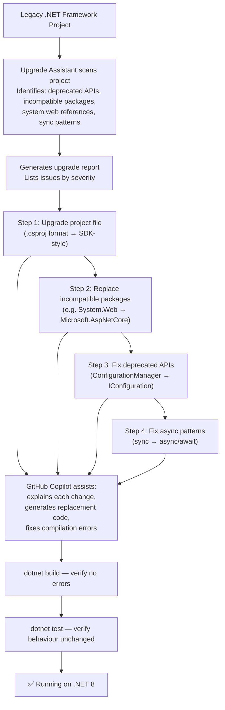
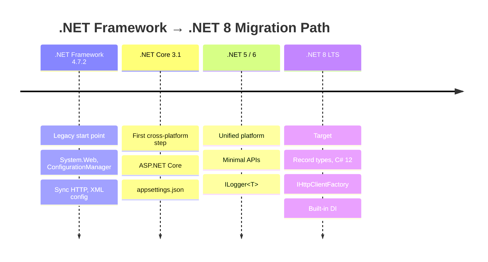
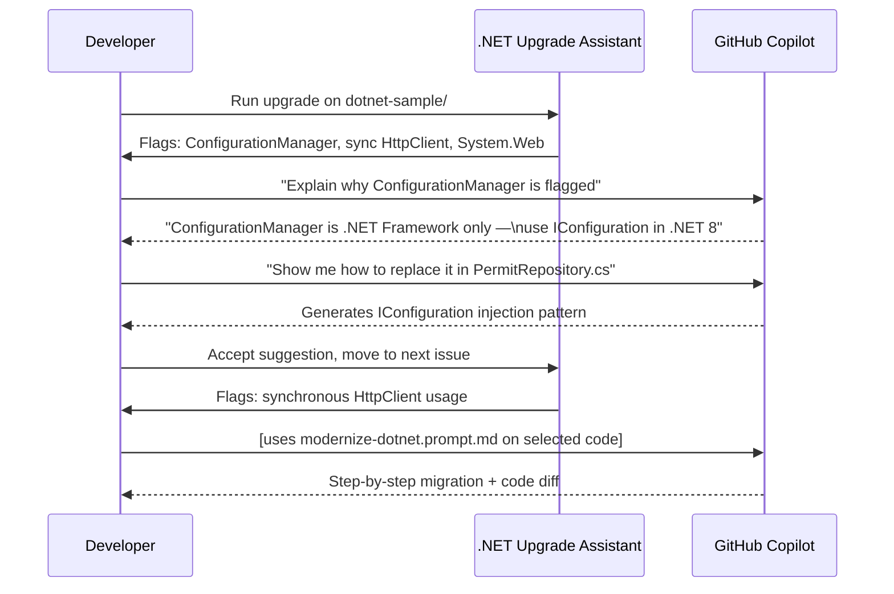

# Module 05 — App Modernization

[](.)
[](.)

> **What you'll learn:** How to use the **.NET Upgrade Assistant** and **Java Modernization Assistant** with GitHub Copilot to incrementally migrate legacy applications. Includes a real legacy .NET Framework 4.7 Web API sample designed to trigger modernization suggestions.

---

## Tooling Comparison

| | .NET Upgrade Assistant | Java Modernization Assistant |
|-|----------------------|------------------------------|
| **Primary IDE** | VS Code, Visual Studio 2022 | VS Code, IntelliJ IDEA |
| **Migration path** | .NET Framework → .NET 8 | Java 8/11 → Java 17/21 |
| **Approach** | AST analysis + incremental project upgrades | AST analysis + code pattern rewrites |
| **Copilot integration** | Suggests code fixes for flagged issues | Suggests modern Java idioms |
| **Output** | Modified project files + solution | Modified source files |
| **VS Code extension** | `ms-dotnettools.vscode-dotnet-pack` | `redhat.java` + Copilot |

---

## .NET Upgrade Assistant Workflow



---

## .NET Migration Timeline



---

## Contents

| Doc / Folder | What it covers |
|-------------|---------------|
| [docs/dotnet-modernization.md](docs/dotnet-modernization.md) | .NET Upgrade Assistant: install, usage, incremental flags |
| [docs/java-modernization.md](docs/java-modernization.md) | Java Modernization Assistant: install, usage, reference |
| [dotnet-sample/](dotnet-sample/) | **Legacy .NET Framework 4.7 Web API** — open this in VS Code and run the Upgrade Assistant |
| [java-sample/](java-sample/) | Legacy Java 8 Servlet app — reference comparison |

---

## How Copilot + Upgrade Assistant Collaborate



---

## Quick Start

```bash
# .NET sample — open in VS Code and run Upgrade Assistant
cd 05-app-modernization/dotnet-sample

# Install .NET Upgrade Assistant (if not already installed)
dotnet tool install --global upgrade-assistant

# Run upgrade analysis (read-only report, no changes applied)
upgrade-assistant analyze PermitApi.csproj

# Then build to confirm starting state
dotnet build
```

For the Java sample, open `java-sample/` in VS Code with the **Java Extension Pack** (`vscjava.vscode-java-pack`) installed — Copilot will automatically offer modernization suggestions as you browse the code.

---

## Related Modules

- [Module 01 — Customization](../01-customization/README.md) — prompt files for modernization tasks
- [Module 06 — QA & Testing](../06-qa-testing/README.md) — verify migrated code with generated tests
- [Module 10 — Lab Exercise 04](../10-hands-on-lab/exercises/exercise-04-modernization.md)
