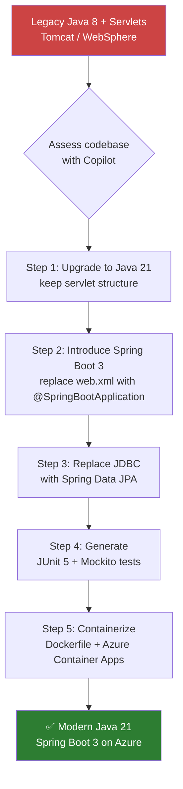

# Java Modernization with GitHub Copilot

> **Copilot role:** Pair programmer guiding incremental Java upgrades — from flagging deprecated APIs to generating Spring Boot 3 endpoints and JUnit 5 tests.

---

## Overview

Java modernization typically involves two axes:

| Axis | Common path | Copilot helps with |
|---|---|---|
| **Language / JDK version** | Java 8 → 17 or 21 | Rewriting deprecated APIs, records, sealed classes, pattern matching |
| **Framework** | J2EE / Servlet → Spring Boot 3 | Generating `@RestController`, `application.yml`, dependency injection |

The Customer <Name>'s legacy Java estate is largely **Java 8 + Servlets** running on WebSphere or Tomcat. The target state is **Java 21 + Spring Boot 3** on Azure Container Apps or Azure App Service.

---

## Prerequisites

### Required VS Code Extensions

| Extension | Publisher | Purpose |
|---|---|---|
| **Extension Pack for Java** | Red Hat | Language server, debugger, Maven/Gradle support |
| **Spring Boot Extension Pack** | VMware | Spring Boot project creation + live reload |
| **GitHub Copilot** | GitHub | AI pair programmer |
| **GitHub Copilot Chat** | GitHub | Chat, prompt files, agent mode |

```bash
# Install the core Java extension pack via CLI
code --install-extension vscjava.vscode-java-pack
code --install-extension vmware.vscode-boot-dev-pack
```

### Required JDKs

Install at least two JDKs side-by-side:

```bash
# Using WinGet (Windows)
winget install Microsoft.OpenJDK.8
winget install Microsoft.OpenJDK.21

# Using SDKMAN (macOS/Linux)
sdk install java 8.0.402-ms
sdk install java 21.0.4-ms
```

---

## Migration Roadmap



---

## Step 1 — Audit Legacy Code with Copilot

Open the legacy `PermitServlet.java` and ask Copilot to review it:

### Audit prompt

```text
Review this Java Servlet class and list every deprecated API, anti-pattern, and
security issue. Group into: (1) Java version issues, (2) architecture issues,
(3) security issues. For each, suggest the modern Java 21 / Spring Boot 3
equivalent.
```

### What Copilot flags in PermitServlet.java

| Legacy pattern | Modern equivalent |
|---|---|
| `HttpServlet` + `doGet/doPost` | `@RestController` + `@GetMapping/@PostMapping` |
| `DriverManager.getConnection(...)` | Spring Data JPA `@Repository` / `JdbcTemplate` |
| Manual `PrintWriter` JSON | Jackson auto-serialisation via `@ResponseBody` |
| Raw SQL string concatenation | JPA named parameters / `@Query` |
| No exception mapping | `@ControllerAdvice` + `@ExceptionHandler` |
| `web.xml` deployment descriptor | `@SpringBootApplication` + `application.yml` |
| `System.out.println` logging | `@Slf4j` + SLF4J / Logback |

---

## Step 2 — Upgrade Java Version

With Copilot Chat open alongside your source file:

```text
This class uses Java 8 APIs. Show me what changes are needed to compile and run
correctly under Java 21. Highlight any removed APIs, renamed packages
(e.g., javax → jakarta), or syntax that can be modernised with Java 17+ features
such as records, sealed classes, and pattern matching.
```

### Key Java 8 → 21 changes for Ontario servlet code

```java
// LEGACY: Java 8 — verbose DTO
public class PermitDto {
    private String permitId;
    private String status;
    // getters, setters, equals, hashCode, toString...
}

// MODERN: Java 16+ — record (immutable DTO in one line)
public record PermitDto(String permitId, String status) {}
```

```java
// LEGACY: Java 8 — instanceof + cast
if (obj instanceof String) {
    String s = (String) obj;
    process(s);
}

// MODERN: Java 16+ — pattern matching instanceof
if (obj instanceof String s) {
    process(s);
}
```

---

## Step 3 — Convert Servlet to Spring Boot 3 Controller

Use the `modernize-dotnet.prompt.md` approach adapted for Java:

```text
Convert this HttpServlet to a Spring Boot 3 @RestController.
Requirements:
- Replace doGet/doPost with @GetMapping/@PostMapping
- Replace manual JSON output with proper return types (Jackson will serialise)
- Use constructor injection for dependencies (no field injection)
- Replace DriverManager with a Spring-injected JdbcTemplate or Repository
- Add @Slf4j for logging
- Map HTTP status codes with ResponseEntity<T>
- Preserve all existing endpoint paths
```

### Before (Servlet)

```java
// From PermitServlet.java — LEGACY:
protected void doGet(HttpServletRequest req, HttpServletResponse resp)
        throws ServletException, IOException {
    String permitId = req.getParameter("id");
    // raw JDBC + manual JSON...
}
```

### After (Spring Boot 3 Controller)

```java
@RestController
@RequestMapping("/api/permits")
@RequiredArgsConstructor
@Slf4j
public class PermitController {

    private final PermitRepository permitRepository;

    /// <summary>Retrieves a permit by its unique identifier.</summary>
    @GetMapping("/{id}")
    public ResponseEntity<PermitDto> getPermit(@PathVariable String id) {
        log.debug("Fetching permit {}", id);
        return permitRepository.findById(id)
                .map(ResponseEntity::ok)
                .orElse(ResponseEntity.notFound().build());
    }
}
```

---

## Step 4 — Replace JDBC with Spring Data JPA

```text
Replace this raw JDBC block with a Spring Data JPA @Repository.
Use a Permit @Entity mapped to the dbo.Permits table.
The repository should extend JpaRepository<Permit, String>.
Add a custom @Query for status filtering.
Target Java 21 and Spring Boot 3.3+.
```

```java
// LEGACY: Raw JDBC (PermitServlet.java)
Connection conn = DriverManager.getConnection(DB_URL, DB_USER, DB_PASS);
PreparedStatement ps = conn.prepareStatement(
    "SELECT * FROM Permits WHERE PermitId = ?");
ps.setString(1, permitId);

// MODERN: Spring Data JPA
public interface PermitRepository extends JpaRepository<Permit, String> {
    List<Permit> findByStatus(String status);

    @Query("SELECT p FROM Permit p WHERE p.region.name = :region")
    List<Permit> findByRegion(@Param("region") String region);
}
```

---

## Step 5 — Generate JUnit 5 Tests

```text
Generate complete JUnit 5 + Mockito unit tests for PermitController.
Cover: happy path (200 OK), not found (404), and null id (400 Bad Request).
Use @ExtendWith(MockitoExtension.class), mock PermitRepository.
Follow Arrange/Act/Assert structure with descriptive method names.
```

```java
@ExtendWith(MockitoExtension.class)
class PermitControllerTest {

    @Mock
    private PermitRepository permitRepository;

    @InjectMocks
    private PermitController controller;

    @Test
    void getPermit_WhenExists_Returns200WithPermit() {
        // Arrange
        var dto = new PermitDto("P-001", "ACTIVE");
        when(permitRepository.findById("P-001")).thenReturn(Optional.of(dto));

        // Act
        var response = controller.getPermit("P-001");

        // Assert
        assertThat(response.getStatusCode()).isEqualTo(HttpStatus.OK);
        assertThat(response.getBody()).isEqualTo(dto);
    }

    @Test
    void getPermit_WhenNotFound_Returns404() {
        // Arrange
        when(permitRepository.findById("UNKNOWN")).thenReturn(Optional.empty());

        // Act
        var response = controller.getPermit("UNKNOWN");

        // Assert
        assertThat(response.getStatusCode()).isEqualTo(HttpStatus.NOT_FOUND);
    }
}
```

---

## Copilot Prompt Reference

| Task | Suggested opening |
|---|---|
| Audit legacy code | "Review this servlet and list every deprecated API…" |
| Upgrade Java version | "Show me what changes are needed to compile under Java 21…" |
| Convert to Spring Boot | "Convert this HttpServlet to a Spring Boot 3 @RestController…" |
| Replace JDBC | "Replace this raw JDBC block with Spring Data JPA…" |
| Generate tests | "Generate JUnit 5 + Mockito tests for this controller…" |
| Containerise | "Write a multi-stage Dockerfile for a Spring Boot 3 / Java 21 app targeting Azure Container Apps" |

---

## Comparison: .NET Upgrade Assistant vs Java Tools

| Feature | .NET Upgrade Assistant | Java Migration (Copilot-assisted) |
|---|---|---|
| **Automated analysis** | ✅ Built-in API analyser | ⚠️ Copilot code review (manual trigger) |
| **In-place rewrites** | ✅ Auto-applies many fixes | ⚠️ Copilot suggestions accepted one-by-one |
| **Project file migration** | ✅ `.csproj` → SDK style | Manual `pom.xml` / `build.gradle` update |
| **IDE integration** | ✅ VS Code extension | ✅ VS Code Java Extension Pack |
| **IntelliJ support** | ❌ N/A | ✅ IntelliJ IDEA + Copilot plugin |
| **Framework migration** | ✅ ASP.NET → ASP.NET Core | ⚠️ Servlet → Spring Boot (Copilot-guided) |

---

## Next Steps

After completing Java modernization:

1. **Module 06 — QA & Testing** → Generate JUnit 5 test plans with Copilot Agent mode
2. **Module 07 — Databases** → Replace raw JDBC with JPA + `mssql` extension query assistance
3. **Module 10 — Lab Exercise 04** → Run the full modernization workflow end-to-end on the sample code
