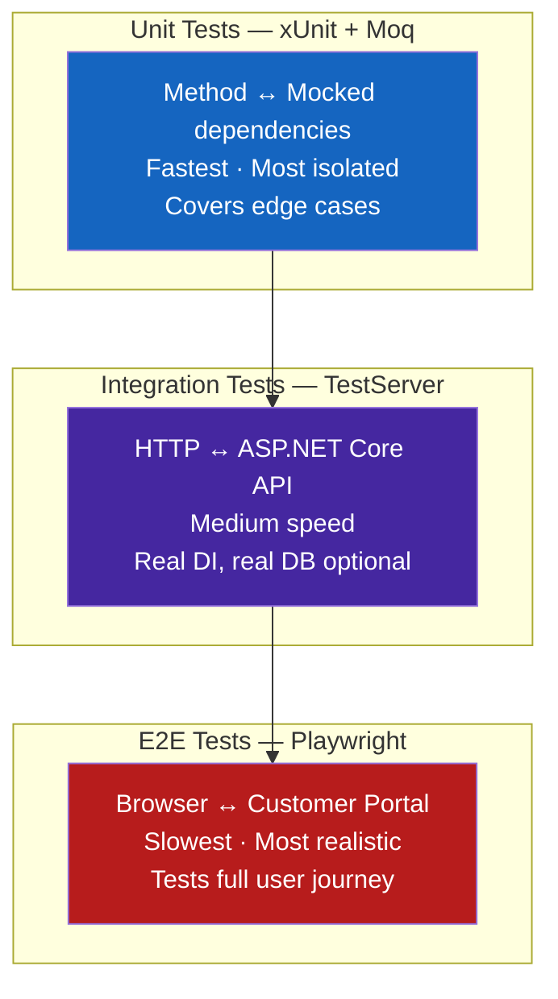

# Testing Strategies with GitHub Copilot

> **Goal:** Understand the three test layers, when Copilot adds the most value in each, and how to wire them up in a .NET 8 / C# solution.

---

## The Three Layers



### When to use each

| Layer | Run on | Feedback loop | Copilot task |
|---|---|---|---|
| Unit | Every commit (CI + local) | < 5 seconds | Generate test class from source class |
| Integration | PR gate (CI) | 30–120 seconds | Generate `WebApplicationFactory` harness |
| E2E | Nightly / release gate | 5–15 minutes | Generate Playwright tests with MCP |

---

## Unit Tests — xUnit + Moq

### Project setup

```xml
<!-- tests/CustomerPermits.Tests.csproj -->
<Project Sdk="Microsoft.NET.Sdk">
  <PropertyGroup>
    <TargetFramework>net8.0</TargetFramework>
    <Nullable>enable</Nullable>
    <IsPackable>false</IsPackable>
  </PropertyGroup>
  <ItemGroup>
    <PackageReference Include="Microsoft.NET.Test.Sdk" Version="17.*" />
    <PackageReference Include="xunit" Version="2.*" />
    <PackageReference Include="xunit.runner.visualstudio" Version="2.*" />
    <PackageReference Include="Moq" Version="4.*" />
    <PackageReference Include="FluentAssertions" Version="6.*" />
  </ItemGroup>
  <ItemGroup>
    <ProjectReference Include="../src/CustomerPermits.csproj" />
  </ItemGroup>
</Project>
```

### Copilot workflow

1. Open the class to test (e.g. `PermitService.cs`)
2. Open Copilot Chat → use the `/generate-tests` prompt
3. Review generated test class in a new file
4. Run `dotnet test` — Agent mode will iterate until green

### Anatomy of a good xUnit test

```csharp
/// Pattern: MethodName_StateUnderTest_ExpectedBehavior
[Fact]
public async Task SubmitPermit_WhenApplicantIsValid_ReturnsPendingStatus()
{
    // Arrange
    var applicant  = new Applicant("Jane Doe", "jane@Customer.ca");
    var permitData = new PermitRequest(applicant, PermitType.Construction);
    _mockRepo.Setup(r => r.SaveAsync(It.IsAny<Permit>()))
             .ReturnsAsync(true);

    // Act
    var result = await _sut.SubmitPermitAsync(permitData);

    // Assert
    result.Status.Should().Be(PermitStatus.Pending);
    _mockRepo.Verify(r => r.SaveAsync(It.IsAny<Permit>()), Times.Once);
}
```

### Key conventions enforced by `.github/copilot-instructions.md`

| Rule | Copilot follows it |
|---|---|
| `// Arrange` / `// Act` / `// Assert` comments | ✅ |
| `MethodName_StateUnderTest_ExpectedBehavior` naming | ✅ |
| `@ExtendWith` → `[Fact]` + `[Theory]` for parameterised | ✅ |
| One behaviour per test | ✅ |
| Moq `Setup` + `Verify` for all dependencies | ✅ |

---

## Integration Tests — WebApplicationFactory

Integration tests hit the real ASP.NET Core middleware pipeline with an in-memory server.

```csharp
public class PermitApiIntegrationTests : IClassFixture<WebApplicationFactory<Program>>
{
    private readonly HttpClient _client;

    public PermitApiIntegrationTests(WebApplicationFactory<Program> factory)
    {
        _client = factory.WithWebHostBuilder(builder =>
        {
            builder.ConfigureServices(services =>
            {
                // Replace real DB with in-memory EF Core for tests
                services.RemoveAll<DbContextOptions<PermitsDbContext>>();
                services.AddDbContext<PermitsDbContext>(opt =>
                    opt.UseInMemoryDatabase("TestDb"));
            });
        }).CreateClient();
    }

    [Fact]
    public async Task GetPermit_WhenExists_Returns200()
    {
        // Arrange — seed via context or POST endpoint

        // Act
        var response = await _client.GetAsync("/api/permits/P-001");

        // Assert
        response.StatusCode.Should().Be(HttpStatusCode.OK);
    }
}
```

### Copilot prompt for integration tests

```text
Generate an xUnit integration test class for PermitController using
WebApplicationFactory<Program>. Replace the real SQL Server DbContext with
an in-memory EF Core database. Seed the database in the constructor.
Cover: GET 200, GET 404, POST 201, POST 400 (validation failure).
```

---

## Coverage Targets

| Layer | Target | Minimum CI gate |
|---|---|---|
| Unit (line coverage) | 85% | 70% |
| Branch coverage | 80% | 65% |
| Integration (happy path) | All controllers | All public endpoints |
| E2E | Critical user journeys | Permit submission + search |

### Check coverage locally

```bash
dotnet test --collect:"XPlat Code Coverage"
reportgenerator -reports:./**/coverage.cobertura.xml -targetdir:coverage-report -reporttypes:Html
start coverage-report/index.html
```

---

## Parameterised Tests with `[Theory]`

Copilot is excellent at generating `[Theory]` / `[InlineData]` tables:

```text
Rewrite this [Fact] as a [Theory] with [InlineData] covering:
valid permit type, invalid permit type, null permit type, and empty string permit type.
```

```csharp
[Theory]
[InlineData("CONSTRUCTION", true)]
[InlineData("RENOVATION",   true)]
[InlineData("INVALID_TYPE", false)]
[InlineData("",             false)]
[InlineData(null,           false)]
public void IsValidPermitType_ReturnsExpected(string? input, bool expected)
{
    var result = PermitTypeValidator.IsValid(input);
    result.Should().Be(expected);
}
```

---

## Next Steps

- [Test Plan Generation](test-plan-generation.md) — Spec → Copilot Agent → test plan
- [Playwright UI Testing](playwright-ui-testing.md) — Playwright MCP + generated E2E tests
- [Module 07 — Databases](../../07-databases/README.md) — Test data setup with T-SQL
