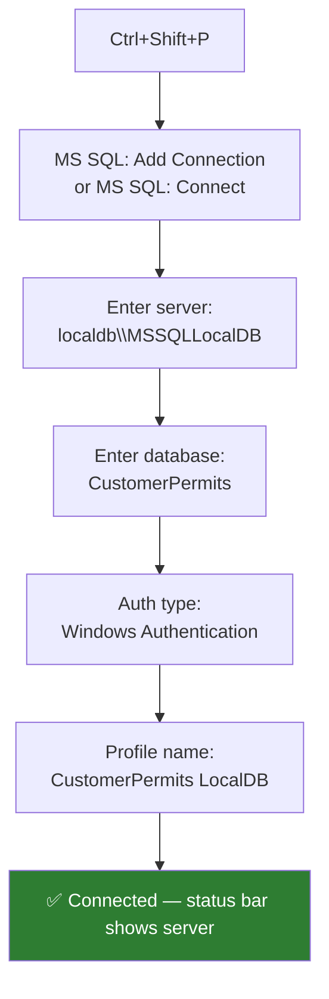

# mssql Extension — Setup and Usage

> **Purpose:** The `mssql` extension turns VS Code into a lightweight SQL IDE with full IntelliSense, query results grid, and GitHub Copilot context-awareness.

---

## Installation

```bash
# Install via CLI
code --install-extension ms-mssql.mssql

# Or search "SQL Server (mssql)" in the Extensions panel
```

---

## Connect to CustomerPermits LocalDB



### Connection string reference

| Field | Value |
|---|---|
| Server | `(localdb)\MSSQLLocalDB` |
| Database | `CustomerPermits` |
| Authentication | Windows Authentication (Integrated) |
| Profile name | `CustomerPermits LocalDB` |

> The `.vscode/settings.json` in this module pre-configures the profile. Open the settings file and VS Code will prompt to use it.

---

## First Run — Create the Schema

1. Open `samples/schema.sql` in VS Code
2. Ensure the mssql status bar shows `CustomerPermits LocalDB`
3. Press `Ctrl+Shift+E` to execute the entire file
4. The Output pane will show `CustomerPermits schema and seed data created successfully.`

---

## Keyboard Shortcuts

| Action | Shortcut |
|---|---|
| Execute query (selection or file) | `Ctrl+Shift+E` |
| Connect to server | `Ctrl+Shift+C` |
| Cancel query | `Alt+Break` |
| Toggle results pane | `Ctrl+Shift+R` |
| Save results as CSV | Right-click results grid |

---

## IntelliSense Features

With the mssql extension connected, Copilot's suggestions are **schema-aware**:

- Table and column name completion
- `JOIN` target suggestions based on foreign key relationships
- Data-type awareness for parameter suggestions
- Hover documentation on column names

### Example — schema-aware Copilot

With `CustomerPermits` connected, typing this prompt in Copilot Chat:

```text
Write a query that joins Permits to Applicants and Regions to show
all pending permits with applicant email
```

Copilot will use the **actual column names** from your connected database (via IntelliSense context), not generic placeholders.

---

## Result Grid Features

| Feature | How to access |
|---|---|
| Save as CSV | Right-click result grid → Save as CSV |
| Save as JSON | Right-click → Save as JSON |
| Copy cell | Click cell → `Ctrl+C` |
| Max rows setting | `mssql.maxRecentConnections` in settings |

---

## Troubleshooting

| Issue | Solution |
|---|---|
| `(localdb)\MSSQLLocalDB` not found | Run `sqllocaldb create CustomerPermits` in a Developer Command Prompt |
| LocalDB not started | `sqllocaldb start MSSQLLocalDB` |
| IntelliSense not loading | Click the server name in status bar → Refresh IntelliSense |
| Extension not connecting | Check VS Code Output → MS SQL for error details |
| Schema changes not reflected | `Ctrl+Shift+P` → MS SQL: Refresh IntelliSense Cache |

---

## Next Steps

- [Copilot SQL Patterns](copilot-sql-patterns.md) — converting natural language to T-SQL
- [queries.sql](../samples/queries.sql) — 10 annotated sample queries
- [stored-procedures.sql](../samples/stored-procedures.sql) — before/after refactoring examples
